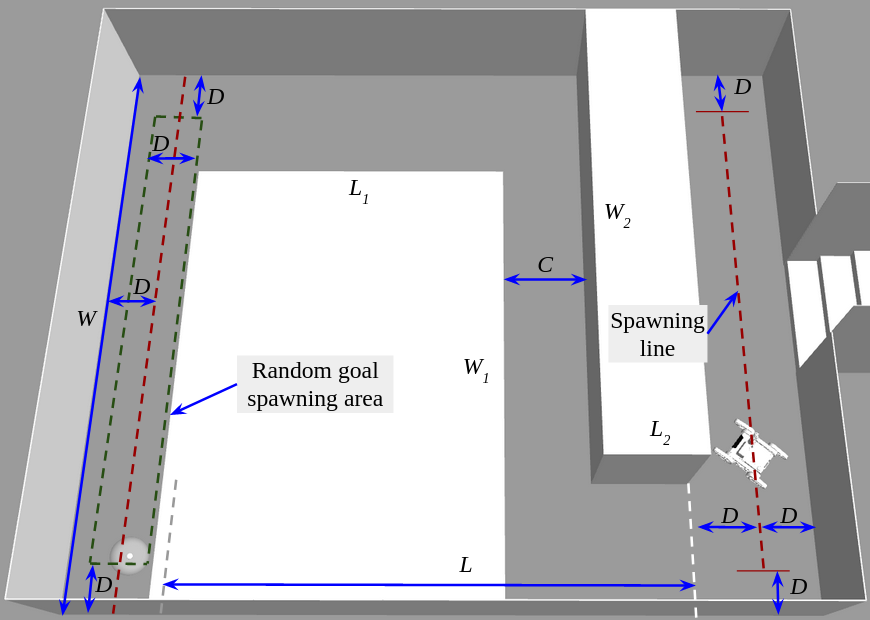
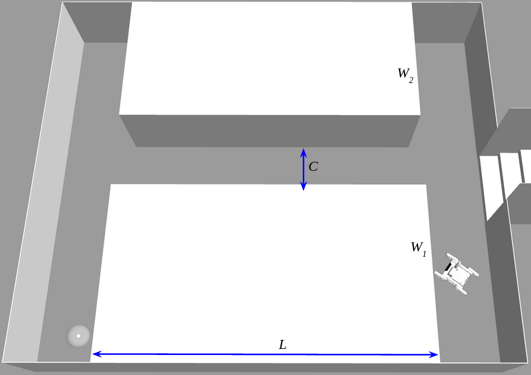
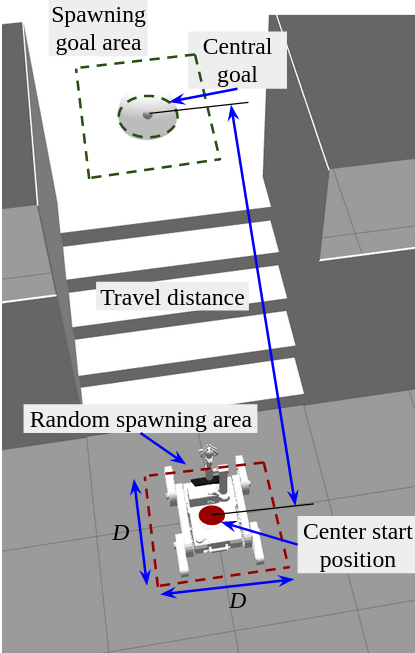

# Simulation package

## Description
This package provides Gazebo simulation utilities.

- - -
## Environment generation
`simulation.launch` starts simulation with basic immovable walls and services that manage environment reconfiguration.

The service `env_gen` works with EnvGen.srv:
```
string action
string model
string props
---
bool result
string err
```
The `action` could be `generate` or `delete`, `model` and `props` depends on the environment part:
* Staircase and floor
    * `model`=`stair_floor`
    * `props`=`rand` or `vect_f` where `f` is a float number which is parsed
* Ground obstacles
    * `model`=`ground_obstacles`
    * `props`=`rand` or `f1_f2_f3_f4` where `f`s are float numbers which represent w1, l1, w2 and l2 ground obstace parameters.
Response fields represent success of operation and error message.
<p align="center">
  
   
   <p align="center">Zigzag (left) and hallway (right) environment structures</p>
</p>
<p align="center">
   
   <p align="center">Staircase and floor environment taxonomy in ascent traversal</p>
</p>


- - -
## Information retrieval
The service `stair_info` operates with StairInfo.srv:
```
---
float64 length
float64 height
float64 number
bool exist
```
where fields `length`, `height` and `number`(number of steps) relates to the staircase parameters, staircase existence is indicated by the `exist` field.

- - -
## Robot (re)spawning

`spawn.launch` initially spawns the Jaguar robot in fornt of the staircase one meter away.
This sub-package provides the service `robot_spawn` to actively respawn the robot at other locations.
RobotSpawn.srv:

```
string place
string task
string random
---
bool result
string err
```
where the `place` is `ground` or `floor`, the `task` field is `flat`, `ascent` or `descent`, `random` is `0` or `1`.

## TODO
1. Calculate z coordiante of the Absolem' centroid.

